# 浮动助手 · 产品设计文档（MVP）

> 本文件为在线飞书文档「浮动助手 · 产品设计文档（MVP）」的本地同步版本，用于随项目版本管理。在线文档：https://feishu.doubao.com/docx/MV3WdsdJuoroE5xPbgScK012nef

## 1. 产品概述

### 1.1 产品定位

一款 Windows 后台常驻的划词工具栏工具。用户在任何应用中拖选一段文字后，工具栏跟随弹出，一键完成**复制**、**搜索**或**智能打开**；这些动作以**插件**形式提供，软件内置**插件管理**能力，便于后续功能以插件方式持续扩展。

### 1.2 目标用户与典型场景

- **高频文本处理者**：在浏览器、文档、代码编辑器之间频繁复制、搜索、打开链接的办公与开发用户。
- **场景一（搜索）**：阅读网页时选中生词或关键词，一键交给默认浏览器搜索。
- **场景二（智能打开）**：从文档或聊天记录中选中 URL、本地路径、邮箱地址，直接打开对应目标。
- **场景三（复制）**：把选中内容复制到别处，省去右键菜单的多层操作。

### 1.3 用户问题与价值

在 Windows 上对选中文本执行复制、搜索、打开通常需要经过右键菜单或先粘贴到地址栏再搜索，路径长、跨应用切换成本高。本产品将这三个高频动作收敛到一个随选即出的浮动工具栏上，让「选中文字后的下一步操作」以最少步骤完成。

## 2. 产品目标与成功指标

### 2.1 产品目标

让「选中文字后的下一步操作」在任意应用中以最少步骤完成；MVP 阶段以**选区捕获的稳定性**与**工具栏响应速度**为核心验收目标。

### 2.2 成功指标

| 指标 | 口径与来源 | 目标值 |
|---|---|---|
| 选区捕获成功率 | 在任意支持文本选择的应用中手动选区后，工具栏正确弹出的比例 | [目标值待产品实测确认] |
| 工具栏弹出延迟 | 从释放鼠标到工具栏可见的耗时 | ≤ 300ms [目标值待确认] |
| 动作执行成功率 | 复制 / 搜索 / 打开命令实际生效的比例 | ≥ 99% [目标值待确认] |

## 3. 范围与非目标

### 3.1 MVP 范围

| 优先级 | 功能 | 说明 |
|---|---|---|
| P0 | 文本选区捕获 | 全局监听并读取其他应用中的选中文本 |
| P0 | 浮动工具栏 | 跟随选区弹出、自动消失、不抢占焦点 |
| P0 | 插件管理 | 插件加载 / 卸载 / 启停 / 配置，便于后续功能以插件形式添加 |
| P0 | 复制 | 以插件形式提供，复制选中文本到系统剪贴板 |
| P0 | 智能打开 | 以插件形式提供，识别 URL / 路径 / 邮箱并调用对应打开方式 |
| P0 | 搜索 | 以插件形式提供，默认浏览器搜索选中文本 |
| P0 | 托盘与常驻 | 后台常驻、托盘图标、开机自启、可退出 |

### 3.2 非目标（暂缓到后续版本）

- 第三方插件商店 / 在线插件分发（MVP 仅支持本地插件目录加载）
- 翻译引擎、词典
- OCR 取词
- AI 问答
- 跨平台（macOS / Linux）

## 4. 核心交互流程

下图描述 MVP 的主流程（正常路径）：

```mermaid
flowchart TD
    A([空闲 · 后台常驻]) --> B{鼠标拖选文字}
    B -- 取消或未选中 --> A
    B -- 捕获成功 --> C[读取选区文本 · UI Automation]
    C --> D[浮动工具栏弹出 · 跟随选区]
    D --> E{用户点击动作}
    E -- 复制 --> F[写入系统剪贴板]
    E -- 搜索 --> G[默认浏览器搜索]
    E -- 智能打开 --> H{识别文本类型}
    H -- URL --> I[浏览器打开链接]
    H -- 本地路径 --> J[按系统默认程序打开]
    H -- 邮箱 --> K[唤起邮件客户端]
    H -- 其他或不确定 --> G
    F --> L[动作完成]
    I --> L
    J --> L
    K --> L
    L --> M[工具栏自动消失]
    M --> A
```



## 5. 功能需求与验收

### 5.1 文本选区捕获

**行为**：当用户在前台应用中按住鼠标拖选一段文字并释放时，系统捕获该选区文本，作为工具栏的动作输入。覆盖目标为所有支持文本选择的应用。

- **验收 1**：在各类可选中文字的应用（浏览器、记事本、Office、代码编辑器、聊天工具等）中手动选区后，均能取得与可见选区一致的文本；覆盖目标为所有支持文本选择的场景。
- **验收 2**：选区被取消（Esc、点击空白）时不弹出工具栏。
- **验收 3**：捕获失败时静默忽略，不产生可见报错。

### 5.2 浮动工具栏

**行为**：工具栏在选区附近弹出，置顶显示但不抢占输入焦点；无操作时自动消失。

- **验收 1**：弹出后鼠标焦点仍在原应用，原窗口可继续滚动与编辑。
- **验收 2**：工具栏在以下任一条件满足时消失——动作执行完成、点击工具栏外区域、无操作超时（建议 5 秒，可配置）。
- **验收 3**：多显示器与不同 DPI 下工具栏不越界、图标不模糊。

### 5.3 插件管理

**行为**：软件内置插件管理能力，工具栏动作以插件形式加载与调度；提供插件列表、启用 / 禁用、配置入口，便于后续功能以插件形式扩展。

- **验收 1**：插件列表展示已安装插件，复制 / 智能打开 / 搜索 为内置插件，默认启用。
- **验收 2**：对插件执行禁用后，工具栏不再显示该动作；重新启用后恢复。
- **验收 3**：单个插件异常（如加载失败、运行崩溃）不影响主程序与其他插件。
- **验收 4**：将合规插件放入插件目录并启用后，工具栏出现对应新动作。

### 5.4 复制

**行为**：点击「复制」将选中文本写入系统剪贴板。

- **验收**：复制后可在任意应用粘贴得到与选区完全一致的文本。

### 5.5 智能打开

**行为**：点击「打开」根据选中文本类型选择打开方式，识别规则如下：

| 文本类型 | 识别方式 | 打开行为 |
|---|---|---|
| URL（http / https） | 正则识别 | 默认浏览器打开链接 |
| 本地路径 | 存在性校验 | 按系统默认关联程序打开（图片 / 音乐 / 视频 / 文档等均按默认程序打开；目录用资源管理器打开） |
| 邮箱地址 | 正则识别 | 唤起默认邮件客户端 |
| 其他 / 不确定 | 兜底 | 默认浏览器搜索 |

### 5.6 搜索

**行为**：点击「搜索」使用默认浏览器搜索选中文本。

- **验收**：搜索词与选区文本一致，URL 正确编码，搜索页正常打开。

### 5.7 托盘与常驻

- **验收 1**：安装后默认开机自启，可在设置中关闭。
- **验收 2**：托盘菜单提供「关于 / 设置 / 退出」入口。
- **验收 3**：退出后无残留进程。

## 6. 异常与边界情况

- 选区文本为空或仅空白字符：不弹出工具栏。
- 目标应用不支持标准选区读取（部分老式程序 / 游戏）：静默降级，不弹空工具栏。
- 剪贴板被占用导致复制失败：提示失败并允许重试。
- 多显示器 / 高 DPI：工具栏位置不越界，图标不模糊。
- 系统休眠 / 锁屏恢复后：全局钩子正常重连，工具栏可继续弹出。
- 与其他同类工具共存时：优先保证自身稳定，用户可一键退出。

## 7. 技术方案

### 7.1 技术选型

**技术选型已确认：C# + WPF（.NET 8 LTS）**。理由：UI Automation 原生支持选区捕获，Win32 互操作成熟（全局钩子 / 托盘 / 自启），XAML 适合构建精致浮层，self-contained 发布可免装运行时。WinUI 3 现代样式作为后续版本规划引入。

| 方案 | 选区捕获难度 | UI 开发效率 | 钩子 / 托盘 | 发布体积 | 结论 |
|---|---|---|---|---|---|
| C# + WPF | 低（UIA 原生） | 高 | 成熟 | 约 60–80MB | 推荐 |
| C++ Win32 / Qt | 高（UIA COM 手写） | 低 | 成熟 | 最小 | 备选（追求极致性能） |
| Tauri (Rust) | 高（Win32 FFI） | 中 | 中 | 小 | 不推荐（学习成本高） |
| Electron | 极高（需 native 插件） | 高 | 别扭 | 大 | 不推荐 |

### 7.2 架构要点

- **选区捕获**：通过 UI Automation 的 TextPattern 读取前台聚焦元素的当前选区。
- **全局监听**：低层鼠标钩子（WH_MOUSE_LL）感知拖选与释放。
- **浮层窗口**：无边框、置顶、不激活（WS_EX_NOACTIVATE）、TopMost。
- **常驻**：托盘图标 + 启动项注册 + 单实例保护。
- **兜底**：捕获失败或目标不支持时静默降级。
- **插件架构**：工具栏动作以插件形式实现，主程序定义统一插件接口（名称 / 图标 / 执行 / 配置）并负责加载与调度。
- **插件加载**：从插件目录动态加载程序集，支持启停与配置，插件异常隔离不影响主程序。

## 8. 质量约束

| 维度 | 约束 | 验证方式 |
|---|---|---|
| 响应速度 | 释放鼠标到工具栏可见 ≤ 300ms [待确认] | 手动计时 / 日志打点 |
| 资源占用 | 常驻内存 ≤ 80MB [待确认] | 任务管理器观测 |
| 兼容性 | 常见文本应用全部通过，并向所有支持文本选择的场景持续覆盖 | 手工回归测试 |
| 稳定性 | 连续运行 7 天无崩溃 [待确认] | 长时间运行测试 |

## 9. 里程碑与依赖

### 9.1 里程碑（建议）

| 阶段 | 内容 | 出口标准 |
|---|---|---|
| M1 技术验证 | 选区捕获 + 浮层窗口原型 + 插件加载验证 | 浏览器与记事本能捕获并弹出工具栏 |
| M2 MVP 功能 | 复制 / 智能打开 / 搜索（插件化）+ 插件管理 + 托盘自启 | 核心功能全部可用 |
| M3 稳定性打磨 | 异常边界、兼容性、性能调优 | 质量约束验收通过 |

### 9.2 依赖

- Windows 10 / 11（Win32 运行环境）
- .NET 8 运行时（或 self-contained 发布）
- 系统默认浏览器与邮件客户端

### 9.3 开放问题

- 成功指标目标值（捕获率 / 延迟 / 内存）待第一轮实测后回填。
- 覆盖应用范围持续扩充，优先保障常见文本应用（浏览器 / 记事本 / Office / 编辑器）的稳定性与兼容性。
- 插件开发接口（统一 IPlugin 规范）与开发文档待首版插件落地后完善。

## 10. M2 MVP 功能技术设计

> M2 阶段在 M1 已落地的工程骨架（选区捕获 + 浮层 + 插件加载 + 托盘雏形）之上，补齐 MVP 完整功能：插件管理界面、配置持久化、托盘交互完善，并完成真实场景回归。本设计为 M2 的实现依据。

### 10.1 设计目标与范围

**目标**：让 MVP 具备可用性闭环——用户可以管理插件（启停 / 加载 / 卸载 / 配置）、设置项可持久化、托盘可常驻自启。

**M2 范围**：

| 功能 | 说明 |
|---|---|
| 插件管理设置窗口 | 插件列表、启停、外部插件加载 / 卸载、配置项 |
| 配置持久化 | 插件启停状态、搜索模板、开机自启等写入本地配置文件 |
| 托盘交互完善 | 插件管理入口、开机自启开关、关于、退出 |
| 工具栏按钮逻辑 | 沿用 M1 已确认逻辑：按插件适配能力（CanHandle）过滤；智能打开仅对 URL / 路径 / 邮箱显示 |
| 手工回归 | 浏览器 / 记事本 / Office 拖选、启停生效、配置生效、自启生效 |

**M2 非目标**：插件市场 / 远程分发、插件配置 UI 自动生成（MVP 用 JSON 配置）、WinUI 3 样式迁移、翻译 / OCR / AI 等新动作。

### 10.2 模块划分与职责

| 模块 | 位置 | 职责 |
|---|---|---|
| 配置模型 | Core/Configuration/AppSettings.cs | 配置数据结构 + JSON 读写 + 默认值 / 损坏回退 |
| 插件管理核心 | Core/Plugins/PluginManager.cs（扩展） | 单 DLL 加载、启停状态持久化钩子 |
| 设置窗口 | App/SettingsWindow.xaml(.cs) | 插件列表、启停、加载 / 卸载、搜索模板配置 |
| 托盘与自启 | App/App.xaml.cs（扩展） | 设置入口、开机自启注册、关于、退出 |

### 10.3 插件管理设计

**设置窗口（SettingsWindow）布局**：

- 插件列表：每行显示 名称 / 描述 / 来源（内置 · 外部 DLL）/ 启用开关
- 操作：「加载插件…」（文件对话框选 DLL）、「卸载所选外部插件」、「恢复默认」
- 配置区：搜索模板文本框（默认 `https://www.bing.com/search?q={0}`）

**PluginManager 扩展**：

- `LoadFromFile(path)`：加载单个外部 DLL（与 LoadFromDirectory 共用程序集加载与容错逻辑）
- `SetEnabled(plugin, enabled)`：启停即时生效并触发持久化
- `Unload(plugin)`：卸载外部插件（内置插件不可卸载，仅可启停）

**工具栏按钮**（沿用 M1 已确认逻辑）：按钮集合 = GetApplicablePlugins(上下文)（启用且 CanHandle）；复制对非空文本始终可用；智能打开仅对 URL / 路径 / 邮箱显示；搜索对非空文本可用。

### 10.4 配置持久化设计

- 路径：`%AppData%\FloatingHelper\settings.json`
- 结构：

```json
{
  "version": 1,
  "searchTemplate": "https://www.bing.com/search?q={0}",
  "plugins": {
    "builtin.copy":        { "enabled": true },
    "builtin.smartopen":   { "enabled": true },
    "builtin.search":      { "enabled": true },
    "external.demo":       { "enabled": true, "path": "C:/.../demo.dll" }
  },
  "autoStart": false
}
```

- 写入时机：设置窗口变更即时保存；退出时保存
- 外部插件按配置记录的路径在启动时加载
- 文件缺失 → 默认值；文件损坏 → 回退默认并保留备份

### 10.5 托盘与常驻完善

托盘菜单：

- 标题（禁用项，显示名称与版本）
- 「插件管理…」→ 打开设置窗口
- 「开机自启」勾选项 → 写注册表 `HKCU\...\CurrentVersion\Run`
- 「关于」→ 关于弹窗
- 「退出」→ 退出程序

行为：托盘双击打开插件管理；设置窗口关闭后回到托盘常驻。

### 10.6 实现顺序

1. AppSettings 配置模型 + 持久化（含单测）
2. PluginManager 扩展（单文件加载、启停持久化，含单测）
3. SettingsWindow 插件管理界面
4. 托盘菜单完善 + 开机自启
5. 端到端手工回归

### 10.7 测试与验收

**单元测试**：

- AppSettings 序列化 / 反序列化 / 缺失与损坏回退
- PluginManager 启停状态保存恢复、外部插件加载容错、过滤逻辑
- SearchUrlBuilder 模板可配置（占位符替换）
- 既有 38 测试保持全绿

**验收标准（M2 出口）**：

- 设置窗口列出 3 个内置插件，启停即时生效，重启后状态保持
- 从文件加载外部插件 DLL 后出现在列表并可执行
- 搜索模板修改后生效
- 托盘含 插件管理 / 开机自启 / 关于 / 退出，自启开关写注册表
- 全部单测通过，浏览器 / 记事本 / Office 手工回归通过
